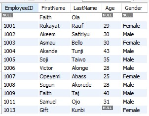
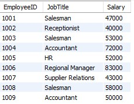
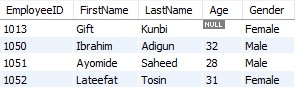

# Employees Database

This project makes use of SQL queries to create a database of employees. The database contains three 
tables namely **Employee demography**, **Employees' salary**, and **Warehouse Employees'demography**

**_Disclaimer:_** Information contained in these tables does not represent any individual. It was just dummy data created to
demonstrate knowledge of SQL

## Skills Demonstrated
-- Creating database, creating tables and Columns, Inserting data into columns

-- SQL SYNTAX used: _CREATE DATABASE_, _CREATE TABLE_, _INSERT INTO_, _INT_, _VARCHAR_, _VALUES_

## Employee demography
This table shows the EmployeeID, FirstName, LastName, Age, and Gender of Employees

## Employee salary
The columns present in this table are EmployeeID, JobTitle, and their respective Salary

## Warehouse_employee_demography
This shows the information of employees that work in the warehouse. The columns contained in this table are the same as that of the employee demography table

## Conclusion
SQL is a great tool for creating databases for storing different data especially when such data contains millions of rows.
